# Personal Agent - Architecture

Personal Agent is a Tauri 2 desktop app (React 19 + TypeScript + Vite frontend, Rust backend) that provides a chat client for any OpenAI-compatible provider.
Conversations persist to a Turso (libsql) cloud database via HTTP, and AI streaming is proxied through Rust to avoid CORS restrictions.
The model can also call tools mid-stream (web search, URL fetch, opt-in memory) proxied through the same Rust layer, and long conversations are automatically summarized to stay within a model's context window.

## 1. High-level overview

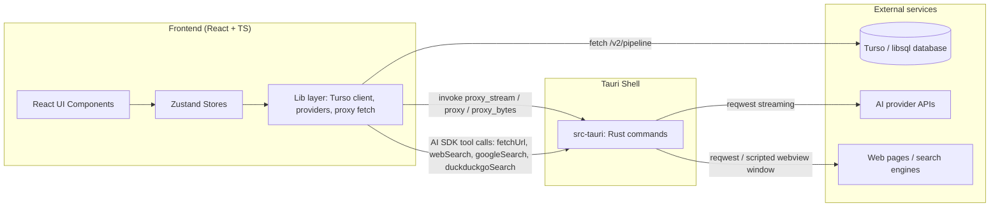

Three distinct outbound paths exist from the frontend:

- **Persistence path**: `fetch` directly to the Turso HTTP API (`/v2/pipeline`) with a bearer token from localStorage.
  Rust is not involved in SQL at all.
- **AI path**: `invoke("proxy_stream")` -> Rust reqwest -> provider API, streaming back over a Tauri `Channel`.
  This bypasses browser CORS and lets the webview connect to arbitrary OpenAI-compatible endpoints.
- **Tool-call path**: the model itself decides to call a tool (`fetchUrl`, `webSearch`, `googleSearch`, `duckduckgoSearch`, plus opt-in `remember`/`recall` for memory) mid-stream; each tool's `execute` runs in the frontend and either proxies an HTTP request through Rust (`proxy`/`proxy_bytes`), drives a dedicated scripted webview window for search engines that require an interactive/human-driven page load, or queries Turso directly (memory tools). See sections 9-11.

## 2. Component tree

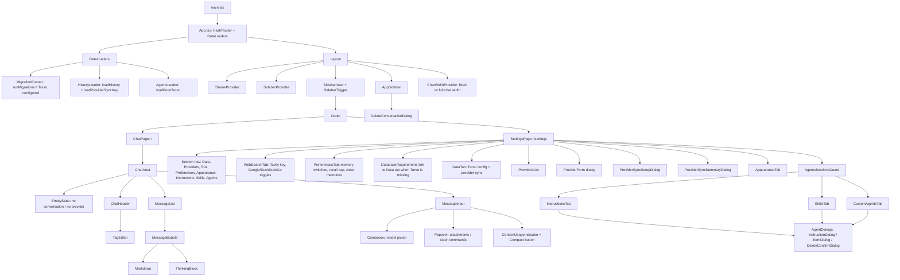

## 3. Zustand store architecture

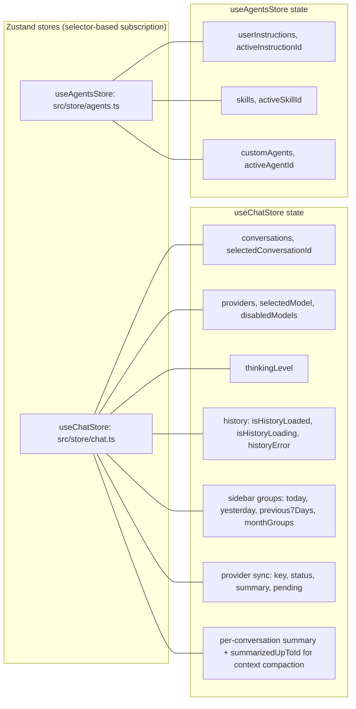

Key selectors and consumers:

- `selectSelectedConversation(state)` (chat.ts:1257) drives `ChatArea` and `useChat`.
- `getSelectedModelInfo(state)` resolves the active model for message metadata.
- Store actions wrap persistence: chat actions call `turso-repository`, agents actions call `agent-repository`, provider actions call `providerStorage` + `providerSync`.
- `useChat` (hooks/use-chat.ts) is the only orchestrator that crosses both stores to compose the system prompt.

## 4. Chat send flow (frontend -> Rust proxy -> AI provider)

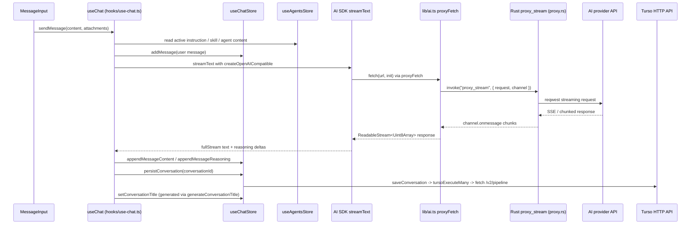

Details:

- When `connectionMode` is `proxy`, the AI SDK gets `fetch: proxyFetch`; otherwise the webview fetches directly (use-chat.ts:253).
- `proxyFetch` (lib/ai.ts) converts a standard `fetch` signature into a Tauri channel stream, and maps `AbortSignal` to `invoke("abort_stream")`.
- Streaming chunks are appended to the message in the store, so the UI updates per token.
- Before the request is sent, `buildOutgoingContext` (lib/context.ts) collapses history into `[persisted summary] + [raw tail]` when a summary exists and its cutoff message is still present; otherwise it sends full history. If estimated tokens exceed 70% of the resolved context window and no valid summary covers the history, auto-compaction runs first (see section 9) before the real request goes out.
- Non-Gemini providers get `tools: { fetchUrl, webSearch?, googleSearch?, duckduckgoSearch?, remember?, recall? }` (built by `buildEnabledTools`, gated on stored API keys/toggles; memory tools additionally require the master memory switch plus a configured Turso database and receive the current `conversationId` for short-term scoping) with `stopWhen: stepCountIs(8)`, so the model can call tools mid-stream and receive results back in the same `streamText` run.
- When memory is enabled, a short tool-use instruction is appended to the system prompt (never any stored memory rows); the prompt is rebuilt from live store state at every send/regenerate/edit so Preferences changes apply to the next request without a reload.
- Conversation and messages are persisted after stream completion (or retry after transient errors with up to 2 retries).
- Attachments are flattened into the user message before sending (`buildUserContent`): images become data-URL image parts, PDFs are text-extracted through Rust (`extract_pdf_text`) and sent as text, and every other supported text file is read as text - so non-image attachments travel as plain text parts rather than binary.
- Editing or regenerating a message inside the already-summarized region invalidates the persisted summary (`isSummaryInvalidatedBy`, store/chat-helpers.ts) so a stale summary is never sent alongside changed history.

## 5. Persistence flow (frontend -> Turso)

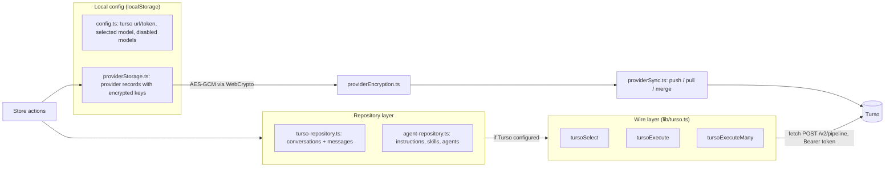

Data mapping:

- `turso.ts` serializes JS values to wire types (`text` / `integer` / `real` / `null`) and maps rows back with `parseValue`.
- Provider deletion is tombstoned: `providerStorage` keeps a `deleted-provider-ids` list in localStorage, and `providerSync.mergeAndApply` skips any id in that list (deleting a stale remote copy if one resurfaces) so a provider the user deleted is never resurrected by a later sync. Tombstones are dropped once the provider is gone from both sides.
- `runMigrations()` (turso-repository.ts) versions the schema through the `schema_meta` table (currently version 8; v7 dropped the transient `messages.reasoning` column, v8 added the `memories` table with dedup/retrieval indexes for opt-in agent memory).
- Tables: `conversations` (incl. `summary`, `summarized_up_to_id`), `messages`, `memories`, `user_instructions`, `skills`, `custom_agents`, `provider_configs`, `schema_meta`.
- SQL is written by hand with `?` placeholders; there is no ORM.
- All CRUD is guarded by `getTursoConfig()` - without a Turso URL/token in localStorage, persistence is a no-op and the app runs in memory only.
- The `memories` table holds both memory types (`short_term` scoped to one conversation via `conversation_id`/`scope_key`, `long_term` global with `NULL` conversation id). SQLite foreign keys are not enforced on the Turso request path, so `deleteConversation()` explicitly deletes scoped memories before messages and the conversation row.
- SQL is written by hand with `?` placeholders; there is no ORM.
- All CRUD is guarded by `getTursoConfig()` - without a Turso URL/token in localStorage, persistence is a no-op and the app runs in memory only.

## 6. Rust backend (src-tauri)

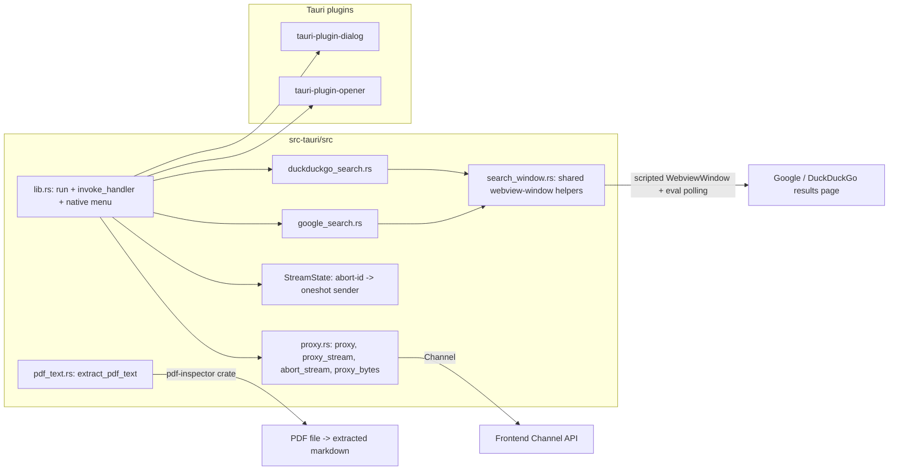

Registered commands (lib.rs):

| Command | Purpose |
| --- | --- |
| `proxy` | One-shot HTTP proxy (JSON in / JSON out) |
| `proxy_stream` | Streaming proxy over `tauri::ipc::Channel` for AI SSE |
| `abort_stream` | Cancels an in-flight stream by `abort_id` |
| `proxy_bytes` | Binary proxy returning base64 (used for file downloads) |
| `google_search` / `collect_google_results` | Opens a scripted Google results webview and scrapes results |
| `duckduckgo_search` / `collect_duckduckgo_results` | Same pattern against DuckDuckGo |
| `extract_pdf_text` | Extracts markdown from a PDF attachment's bytes (via the `pdf-inspector` crate, capped at 20 MB, wrapped in `catch_unwind` for malformed files) |
| `write_file` | Writes bytes to a path chosen via the save dialog |

Rust holds no application state beyond `StreamState` (a map of abort IDs to oneshot senders); all business logic lives in the frontend. `google_search`/`duckduckgo_search` are the exception: `search_window.rs` opens a real, visible `WebviewWindow` pointed at the engine's results page, injects a "Done" button via `initialization_script`, and polls (`eval_with_callback`, 500ms interval, 2 minute timeout) until the user clicks it and `window.__paResults` is populated - this is a human-in-the-loop scrape, not a headless request, because these engines block scripted/headless traffic.

lib.rs also builds a native application menu in `.setup()` via `build_menu` (App / File / Edit / View / Window / Help submenus). The Help submenu adds "GitHub Repository" and "Report an Issue" items handled by `on_menu_event`, which opens the matching URL through `tauri-plugin-opener`. This native menu replaces the default OS-generated menu so platform-specific items (About, Hide, Quit on macOS) behave consistently.

## 7. Module and path conventions

Path aliases (tsconfig.json): `#components/*`, `#lib/*`, `#hooks/*`, `#store/*`.

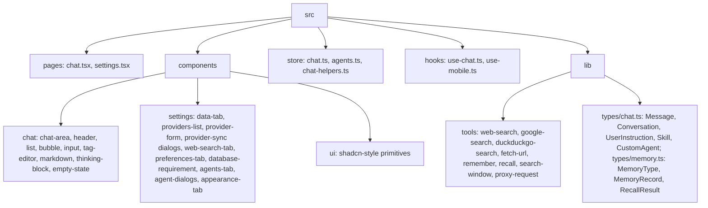

Responsibilities by layer:

- **pages** - route-level shells, no business logic.
- **components/chat** - pure presentational chat UI; reads stores via selectors; uses `useChat` for actions.
- **components/settings** - settings UI with local component state; calls store actions.
- **components/ui** - reusable shadcn/ui primitives (button, dialog, sidebar, combobox, etc.).
- **components/chat-width-provider** - React context for the fixed-vs-full chat column width toggle, persisted via `lib/config.ts`.
- **store** - zustand stores that own state + orchestrate persistence.
- **hooks/use-chat** - chat orchestration (streaming, retries, title generation, offline handling, context compaction).
- **lib** - stateless infrastructure: Turso wire client, repositories, provider storage/encryption/sync, Tauri proxy fetch, config keys, download helpers, AI SDK glue, context/token estimation (`context.ts`).
- **lib/tools** - AI SDK `tool()` definitions the model can call mid-stream, each individually toggled on in Settings > Tool: `fetchUrl` (proxied GET + HTML-to-text), `webSearch` (Tavily API, also needs a saved API key), `googleSearch`/`duckduckgoSearch` (drive the Rust scripted-webview scrape via `search-window.ts`), `proxy-request` (shared `invoke("proxy")` wrapper). Memory tools `remember`/`recall` (Settings > Preferences master switch + Turso required) persist to the `memories` table via `memory-repository.ts`; see section 11.
- **lib/types/memory.ts** - shared `MemoryType` (`short_term` | `long_term`), `MemoryRecord`, and the bounded `RecallResult` returned to the model.

## 8. Startup sequence

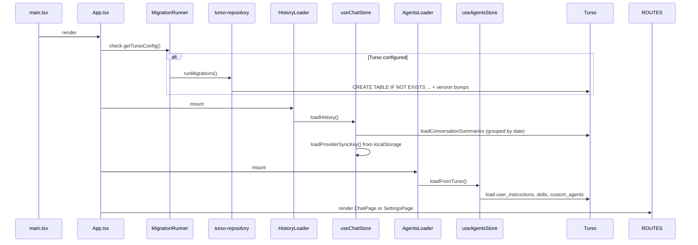

## 9. Context compaction

Plans: `plans/context-compaction.md`, `plans/sidebar-optimization.md`. Tickets 21-26.

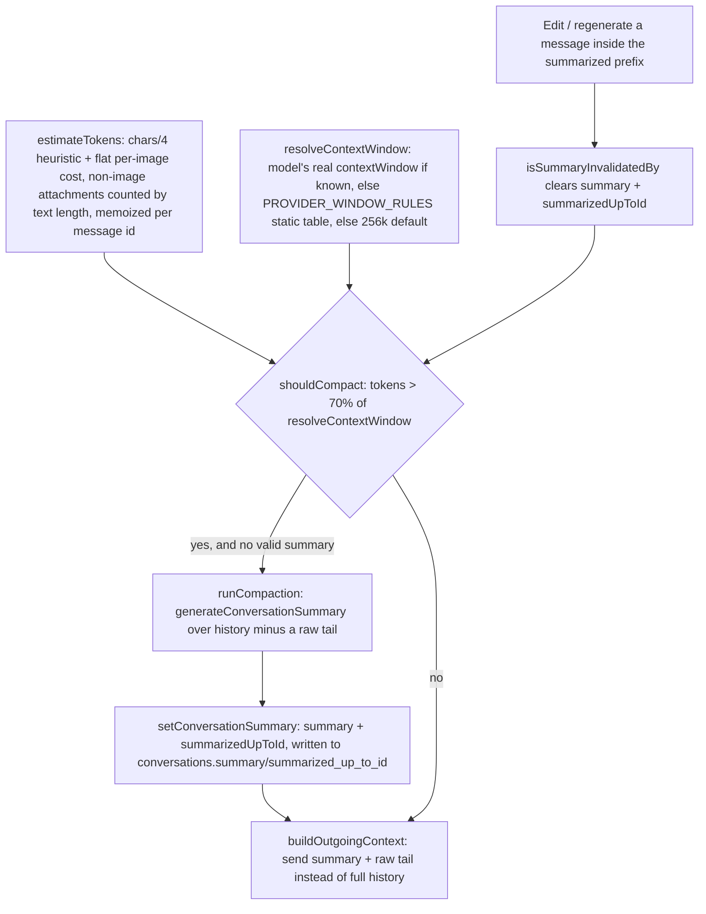

- Auto-compaction runs inline in `use-chat.ts` right before a request would exceed the threshold; a manual "Compact" button (`compactNow`) in `MessageInput` triggers the same `runCompaction` path on demand, both guarded by their own `AbortController`.
- A fixed-size raw tail (`compactionTailSize`) is always kept unsummarized so the most recent turns stay verbatim in context even immediately after compaction.
- If compaction itself fails (e.g. provider error), the send proceeds with full history rather than blocking the message.
- `ContextUsageIndicator` (message-input.tsx) surfaces the same `estimateTokens`/`resolveContextWindow` numbers live in the UI so the user sees usage before it triggers compaction.

## 10. Agentic tool calling (web search / fetch)

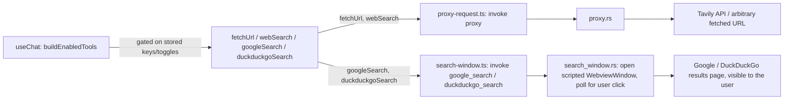

- Tools are disabled entirely for Gemini-family providers (`isGeminiProvider`) due to a known 400 with tool schemas; otherwise `buildEnabledTools` assembles whichever tools are individually toggled on in `WebSearchTab` settings - `fetchUrl` and `googleSearch`/`duckduckgoSearch` are plain on/off switches, `webSearch` additionally requires a saved Tavily API key.
- `streamText` is called with `stopWhen: stepCountIs(8)`, so the model can chain multiple tool calls (e.g. search then fetchUrl) within one send before the AI SDK forces a stop.
- `googleSearch`/`duckduckgoSearch` are deliberately human-in-the-loop: they open a real, visible Tauri window on the actual results page (not a headless scrape) because both engines block scripted traffic; the model waits on `poll_for_results` until the user reviews results and clicks "Done".

## 11. Agent memory (remember / recall)

Plans: `plans/memory.md`.

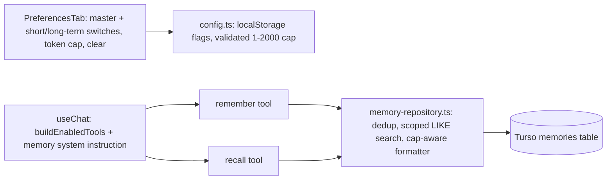

- Memory is off by default and model-controlled: stored rows are never injected into the prompt automatically. When enabled, the model gets `remember`/`recall` tool definitions plus a short usage instruction; it calls `recall` only when prior context seems relevant.
- Both types share one `memories` table discriminated by `memory_type`. `short_term` rows are scoped to the current `conversationId` (passed by the application, never chosen by the model) and deleted explicitly with their conversation; `long_term` rows are global (`NULL` conversation id, `global` scope key).
- Writes deduplicate deterministically on `(memory_type, scope_key, normalized_content)` (trimmed + case-folded) via `INSERT OR IGNORE`, so stream retries cannot create duplicates. Queries escape `%`, `_`, and `\` and use an explicit `ESCAPE` clause.
- `recall` results are bounded by the configured token cap (default 500, range 1-2000), counting labels and separators via `estimateTextTokens`; oversized rows are truncated or omitted and the result carries a `truncated` flag. The formatter lives in `memory-repository.ts` so cap enforcement and label overhead stay in one place.
- Memory failures are bounded `{ error }` / empty-result tool results that never abort the assistant response. Disabling memory stops new reads/writes but keeps existing rows for re-enabling; clearing requires confirmation in Preferences.
- There are no embeddings, vector search, or automatic per-turn extraction - retrieval is an explicit, bounded tool lookup.
