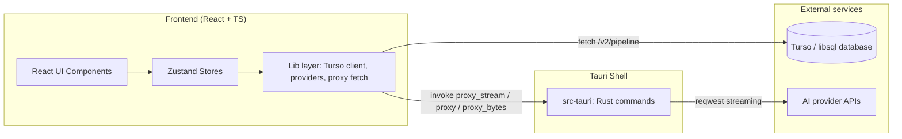
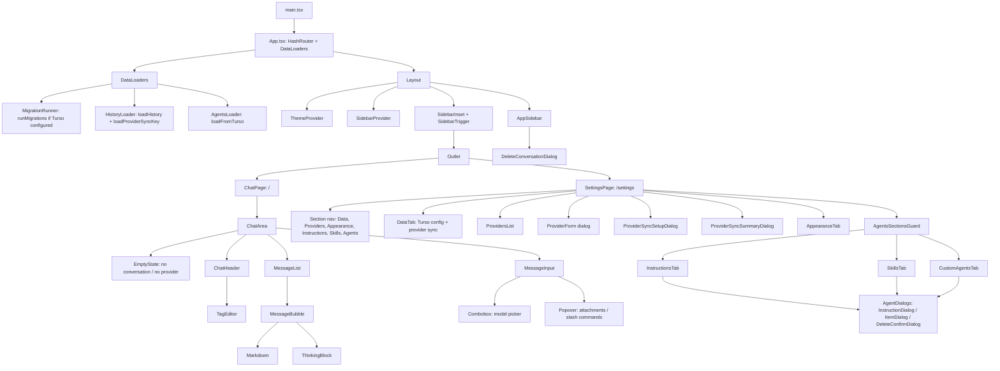
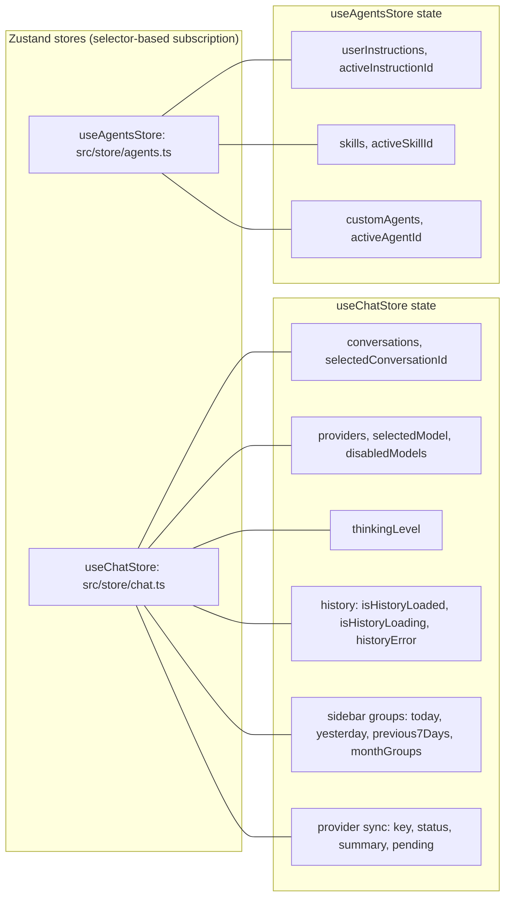
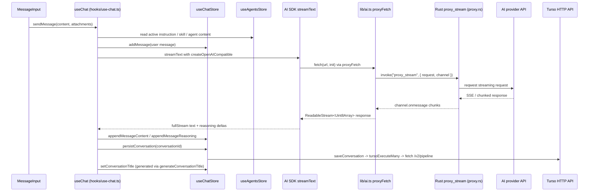
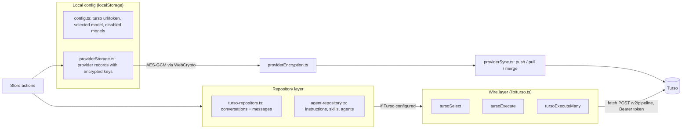
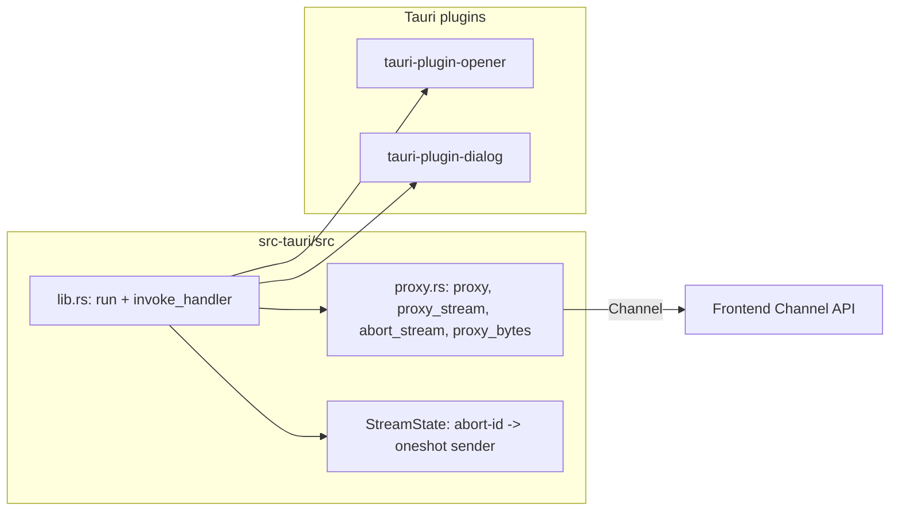
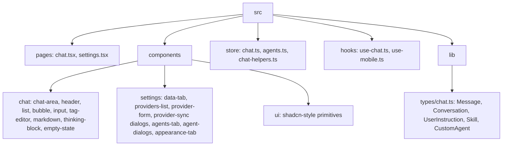
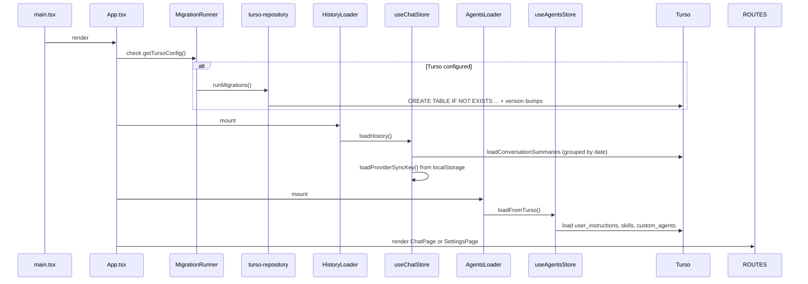

# Personal Agent - Architecture

Personal Agent is a Tauri 2 desktop app (React 19 + TypeScript + Vite frontend, Rust backend) that provides a chat client for any OpenAI-compatible provider.
Conversations persist to a Turso (libsql) cloud database via HTTP, and AI streaming is proxied through Rust to avoid CORS restrictions.

## 1. High-level overview

Two distinct outbound paths exist from the frontend:

- **Persistence path**: `fetch` directly to the Turso HTTP API (`/v2/pipeline`) with a bearer token from localStorage.
  Rust is not involved in SQL at all.
- **AI path**: `invoke("proxy_stream")` -> Rust reqwest -> provider API, streaming back over a Tauri `Channel`.
  This bypasses browser CORS and lets the webview connect to arbitrary OpenAI-compatible endpoints.

## 2. Component tree

## 3. Zustand store architecture

Key selectors and consumers:

- `selectSelectedConversation(state)` (chat.ts:1257) drives `ChatArea` and `useChat`.
- `getSelectedModelInfo(state)` resolves the active model for message metadata.
- Store actions wrap persistence: chat actions call `turso-repository`, agents actions call `agent-repository`, provider actions call `providerStorage` + `providerSync`.
- `useChat` (hooks/use-chat.ts) is the only orchestrator that crosses both stores to compose the system prompt.

## 4. Chat send flow (frontend -> Rust proxy -> AI provider)

Details:

- When `connectionMode` is `proxy`, the AI SDK gets `fetch: proxyFetch`; otherwise the webview fetches directly (use-chat.ts:253).
- `proxyFetch` (lib/ai.ts) converts a standard `fetch` signature into a Tauri channel stream, and maps `AbortSignal` to `invoke("abort_stream")`.
- Streaming chunks are appended to the message in the store, so the UI updates per token.
- Conversation and messages are persisted after stream completion (or retry after transient errors with up to 2 retries).

## 5. Persistence flow (frontend -> Turso)

Data mapping:

- `turso.ts` serializes JS values to wire types (`text` / `integer` / `real` / `null`) and maps rows back with `parseValue`.
- `runMigrations()` (turso-repository.ts) versions the schema through the `schema_meta` table (currently version 5).
- Tables: `conversations`, `messages`, `user_instructions`, `skills`, `custom_agents`, `provider_configs`, `schema_meta`.
- SQL is written by hand with `?` placeholders; there is no ORM.
- All CRUD is guarded by `getTursoConfig()` - without a Turso URL/token in localStorage, persistence is a no-op and the app runs in memory only.

## 6. Rust backend (src-tauri)

Registered commands (lib.rs):

| Command | Purpose |
| --- | --- |
| `proxy` | One-shot HTTP proxy (JSON in / JSON out) |
| `proxy_stream` | Streaming proxy over `tauri::ipc::Channel` for AI SSE |
| `abort_stream` | Cancels an in-flight stream by `abort_id` |
| `proxy_bytes` | Binary proxy returning base64 (used for file downloads) |
| `write_file` | Writes bytes to a path chosen via the save dialog |

Rust holds no application state beyond `StreamState` (a map of abort IDs to oneshot senders); all business logic lives in the frontend.

## 7. Module and path conventions

Path aliases (tsconfig.json): `#components/*`, `#lib/*`, `#hooks/*`, `#store/*`.

Responsibilities by layer:

- **pages** - route-level shells, no business logic.
- **components/chat** - pure presentational chat UI; reads stores via selectors; uses `useChat` for actions.
- **components/settings** - settings UI with local component state; calls store actions.
- **components/ui** - reusable shadcn/ui primitives (button, dialog, sidebar, combobox, etc.).
- **store** - zustand stores that own state + orchestrate persistence.
- **hooks/use-chat** - chat orchestration (streaming, retries, title generation, offline handling).
- **lib** - stateless infrastructure: Turso wire client, repositories, provider storage/encryption/sync, Tauri proxy fetch, config keys, download helpers, AI SDK glue.

## 8. Startup sequence

