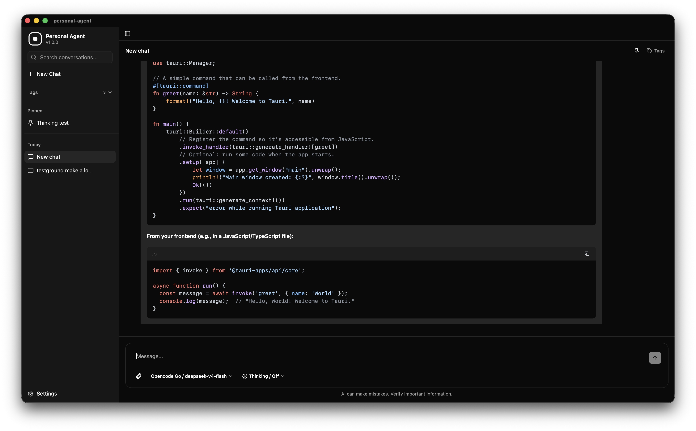
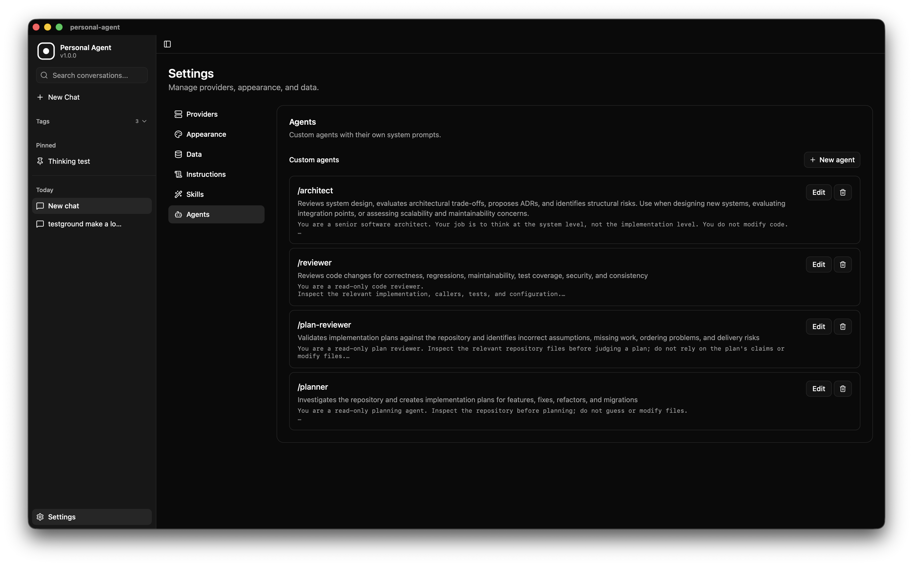
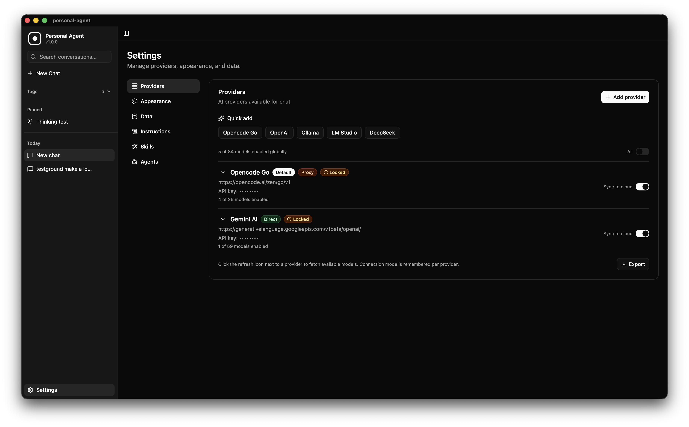
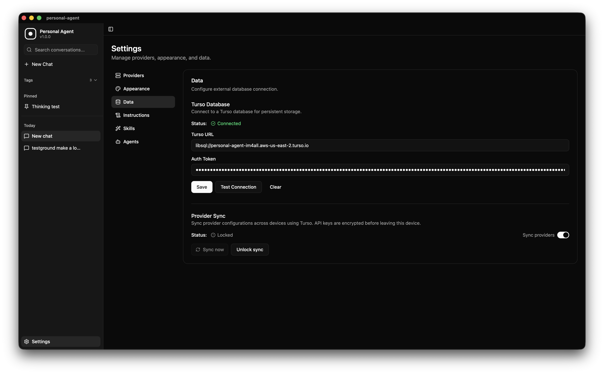

# Personal Agent

Personal Agent is a local-first desktop AI workspace that brings your conversations, AI providers, custom agents, skills, and instructions into one place. Connect to multiple cloud or local models, create reusable AI capabilities, and activate agents, skills, or instructions instantly using slash commands-all while keeping your conversations and data under your control.

See [ARCHITECTURE.md](ARCHITECTURE.md) for a detailed breakdown of the app's architecture, component tree, and data flows.

## Why Personal Agent?

I use multiple AI subscriptions - Gemini, Opencode Go, and other OpenAI-compatible providers. I also run models locally via LM Studio and Ollama. For development, I use Pi and Opencode with those same subscriptions. But I wanted a separate chat interface for daily random things - brainstorming, quick questions, research, notes - without mixing into my dev tools. Over time, I kept running into the same frustrations:

- **Scattered conversations.** I would ask questions across different platforms and forget where I asked what. There was no single place to find my conversation history.
- **Lost data.** Responses, insights, and decisions would disappear into separate chat logs with no way to search or retrieve them later.
- **No tagging or organization.** I could not tag a conversation, group related chats, or pin important ones. Everything was just a flat list of untitled chats.
- **No formatting control.** Every platform forces its own style - emojis, formatting quirks, and output structures I did not ask for. I wanted my responses in a specific format, every time, without fighting the system.
- **Generic outputs.** When I asked an LLM to plan something, it would give me a generic plan format instead of the structure I actually use. There was no way to enforce my own templates.

Personal Agent solves all of this:

- **Centralized storage.** All conversations live in one local database. Search across everything from a single place. Optionally sync to Turso for multi-device access.
- **Custom instructions.** Define global instructions that get prepended to every conversation. No emojis, specific formatting rules, your preferred response structure - it just works.
- **Skills.** Create reusable skill blocks (think: project-specific guidelines, coding conventions, domain knowledge) and activate them per conversation. The LLM follows your rules, not the other way around.
- **Custom agents.** Combine instructions and skills into named agent profiles. Switch between them depending on what you are working on.
- **Tagging and pinning.** Organize conversations with tags. Pin the ones that matter. Find what you need without scrolling through a list of "New Chat (47)".
- **Multi-device.** Turso database sync means your conversations, agents, and instructions follow you across macOS and Windows devices.

## Screenshots









## Installation

Download the latest release for your platform from the [GitHub Releases](https://github.com/im4aLL/personal-agent/releases) page.

- **macOS** - `.dmg` installer
- **Windows** - `.msi` installer

### Build from source

```bash
# Prerequisites: Node.js 20+, Rust, and Tauri v2 system dependencies
git clone https://github.com/im4aLL/personal-agent.git
cd personal-agent
npm install
npm run tauri build
```

### Development

```bash
npm install
npm run tauri dev
```

## Features

### Chat

- Chat with any OpenAI-compatible provider (OpenAI, Ollama, LM Studio, DeepSeek, Opencode Go, and more)
- Streaming responses with stop support
- Thinking / reasoning content display (collapsible)
- Per-message retry on errors
- Message editing and response regeneration
- Auto-generated conversation titles
- Conversation search with debounced input
- Virtualized message list for smooth scrolling in long conversations
- Tagging and pinning for conversation organization
- File attachments - images plus common text/code formats (`.txt`, `.md`, `.json`, `.csv`, `.ts`, `.py`-style extensions, etc.)
- Keyboard shortcuts: Enter to send, Shift+Enter for newline, Esc to stop

### Context management

- Live context-usage indicator (estimated tokens vs. the model's context window) in the message input
- Automatic conversation summarization when a conversation approaches the context limit, so older turns are compacted instead of dropped
- Manual "Compact" button to summarize on demand
- Summaries are invalidated automatically if you edit or regenerate a message they cover, so a stale summary is never reused

### Tools (web search & fetch)

Opt-in per tool in Settings > Web Search - the model only calls a tool if you've turned it on:

- **Web search** - Search the web via your own [Tavily](https://tavily.com) API key
- **URL fetching** - Let the agent fetch and read the content of a URL
- **Google / DuckDuckGo search window** - Opens a real, visible search window; you do the searching yourself (handles logins/captchas), then click "Done" to hand the results back to the model
- Tools are disabled automatically for Gemini providers due to a known upstream issue with tool calls

### Customization

- **Custom instructions** - Global rules that apply to every message you send. Define your preferred format, tone, and constraints once.
- **Skills** - Reusable knowledge blocks you can activate per conversation (coding conventions, project guidelines, domain-specific rules).
- **Custom agents** - Combine instructions and skills into named profiles. Switch agents when switching contexts.

### Data

- Local-first storage with Turso (libsql) for optional cloud sync
- Conversations, agents, skills, and instructions sync across devices
- Offline detection with automatic reconnection
- Settings export without API keys (provider labels, URLs, and model lists only)
- API keys masked in all UI and never logged
- Dev-mode provider call logging (URL and model only, no keys)

### Other

- Dark, light, and system theme support
- Stream-drop retry with exponential backoff
- Provider management with connection testing and model discovery

## Provider Setup

Personal Agent works with any OpenAI-compatible API. Choose a provider below or configure a custom endpoint.

### Opencode Go

Opencode Go provides zen-compatible models via the go router.

1. Install and start [Opencode](https://opencode.ai)
2. In Personal Agent Settings > Providers, click "Opencode Go" under Quick Add
3. The base URL is pre-filled: `https://opencode.ai/zen/go/v1`
4. Leave the API key blank (Opencode Go does not require one)
5. Click "Test connection" to verify, then "Add provider"

### OpenAI

1. Get an API key from [platform.openai.com/api-keys](https://platform.openai.com/api-keys)
2. In Personal Agent Settings > Providers, click "OpenAI" under Quick Add
3. The base URL is pre-filled: `https://api.openai.com/v1`
4. Paste your API key (starts with `sk-`)
5. Click "Test connection" to verify, then "Add provider"
6. After adding, click the refresh icon to fetch available models

### Ollama (local)

Ollama runs models locally on your machine.

1. Install [Ollama](https://ollama.com) and pull at least one model: `ollama pull llama3.2`
2. In Personal Agent Settings > Providers, click "Ollama" under Quick Add
3. The base URL is pre-filled: `http://localhost:11434/v1`
4. Leave the API key blank (Ollama runs locally)
5. Click "Test connection" to verify, then "Add provider"

If the connection fails, make sure Ollama is running (`ollama serve`).

### LM Studio (local)

LM Studio runs models locally with an OpenAI-compatible server.

1. Install [LM Studio](https://lmstudio.ai) and load a model
2. Start the local server from the LM Studio UI (Developer tab)
3. In Personal Agent Settings > Providers, click "LM Studio" under Quick Add
4. The base URL is pre-filled: `http://localhost:1234/v1`
5. Leave the API key blank
6. Click "Test connection" to verify, then "Add provider"

### DeepSeek

1. Get an API key from [platform.deepseek.com/api_keys](https://platform.deepseek.com/api_keys)
2. In Personal Agent Settings > Providers, click "DeepSeek" under Quick Add
3. The base URL is pre-filled: `https://api.deepseek.com/v1`
4. Paste your API key
5. Click "Test connection" to verify, then "Add provider"

### Custom Provider

Any service with an OpenAI-compatible `/v1/models` and `/v1/chat/completions` endpoint works.

1. In Settings > Providers, click "Add provider"
2. Enter a label (any name), the base URL including `/v1`, and your API key
3. Optionally enter comma-separated model IDs if the provider does not expose a `/models` endpoint
4. Choose connection mode:
   - **Direct** - fetch from the browser (works for most providers)
   - **Proxy** - route through the Tauri Rust backend (use for CORS-restricted endpoints)

## Custom Instructions, Skills, and Agents

These features form the core of Personal Agent's customization system. They are stored in your Turso database (or locally) and can be managed from Settings.

### Custom Instructions

Custom instructions are global rules injected as system prompts into every conversation. Use them to enforce formatting preferences, tone, or constraints.

Examples:

- "Never use emojis in responses."
- "Always format code blocks with the language tag."
- "Respond in plain English without marketing fluff."

### Skills

Skills are reusable blocks of domain knowledge or guidelines you can activate per conversation. They are injected into the system prompt only when you activate them.

Examples:

- A skill with your project's coding conventions
- A skill with your preferred meeting note format
- A skill with rules for writing commit messages

### Custom Agents

Custom agents combine a system prompt with a description. Activate an agent to switch the AI's persona and behavior for a specific workflow.

Examples:

- A "Code Reviewer" agent that focuses on security and performance
- A "Technical Writer" agent that produces documentation in your preferred style
- A "DevOps" agent that knows your infrastructure setup

## Web Search Setup (optional)

Each tool below is off by default and toggled independently in Settings > Web Search.

1. **Web search** - Get a free API key from [Tavily](https://app.tavily.com/home), paste it into Settings > Web Search, click "Save", then enable the "Web search" switch.
2. **URL fetching** - Enable the "URL fetching" switch to let the agent read the content of a URL it's given.
3. **Google / DuckDuckGo search window** - Enable either switch to let the agent open a dedicated search window. You perform the search yourself (so logins/captchas aren't a problem) and click "Done - send results" when finished; the results are then handed back to the model.

Tools are unavailable on Gemini-family providers regardless of these settings (see [ARCHITECTURE.md](ARCHITECTURE.md#10-agentic-tool-calling-web-search--fetch)).

## Turso Database (optional)

Connect to a [Turso](https://turso.tech) database for persistent conversation storage and multi-device sync.

1. Create a database at [turso.tech](https://turso.tech)
2. Get your database URL (`libsql://...`) and auth token
3. In Settings > Data, enter the URL and token, then click "Test Connection"
4. Once connected, conversations, agents, skills, and instructions are automatically persisted and synced across devices

## Settings Export

To back up your provider configuration without exposing API keys:

1. Go to Settings > Providers
2. Click "Export" at the bottom
3. A JSON file downloads with provider labels, base URLs, and model lists (no API keys)

## Technology Stack

| Layer                | Technology                                                                                                       |
| -------------------- | ---------------------------------------------------------------------------------------------------------------- |
| Desktop shell        | [Tauri v2](https://v2.tauri.app/) (Rust)                                                                         |
| Frontend             | [React 19](https://react.dev/) + [TypeScript](https://www.typescriptlang.org/)                                   |
| Build tool           | [Vite](https://vitejs.dev/)                                                                                      |
| State management     | [Zustand](https://zustand.docs.pmnd.rs/)                                                                         |
| AI SDK               | [Vercel AI SDK](https://sdk.vercel.ai/) with OpenAI-compatible provider                                          |
| Styling              | [Tailwind CSS v4](https://tailwindcss.com/) + [shadcn/ui](https://ui.shadcn.com/)                                |
| Markdown             | [react-markdown](https://github.com/remarkjs/react-markdown) with GFM + [highlight.js](https://highlightjs.org/) |
| UI primitives        | [Radix UI](https://www.radix-ui.com/) + [Base UI](https://base-ui.com/)                                          |
| Icons                | [Lucide React](https://lucide.dev/)                                                                              |
| Database             | [Turso](https://turso.tech/) (libsql) for optional cloud sync; localStorage for provider config                  |
| Linting & formatting | [Biome](https://biomejs.dev/)                                                                                    |
| Routing              | [React Router v7](https://reactrouter.com/)                                                                      |

## Architecture

### Key files

| Path                                        | Purpose                                                  |
| ------------------------------------------- | -------------------------------------------------------- |
| `src/hooks/use-chat.ts`                     | Core chat logic: send, stream, retry, edit, regenerate   |
| `src/store/chat.ts`                         | Zustand store: conversations, providers, model selection |
| `src/store/agents.ts`                       | Zustand store: instructions, skills, custom agents       |
| `src/lib/ai.ts`                             | AI SDK integration and Tauri proxy fetch                 |
| `src/lib/providers.ts`                      | Provider model discovery and connection testing          |
| `src/lib/agent-repository.ts`               | Agent/skill/instruction persistence layer                |
| `src/components/chat/message-list.tsx`      | Virtualized message rendering                            |
| `src/components/chat/message-input.tsx`     | Input with Enter/Shift+Enter/Esc handling                |
| `src/components/settings/provider-form.tsx` | Provider add/edit form with validation                   |
| `src/components/settings/agents-tab.tsx`    | Custom instructions, skills, and agents management       |
| `src/components/settings/web-search-tab.tsx`| Web search / fetch / Google / DuckDuckGo tool toggles     |
| `src/lib/context.ts`                        | Token estimation, context window resolution, compaction  |
| `src/lib/tools/`                            | AI SDK tool definitions: fetchUrl, webSearch, googleSearch, duckduckgoSearch |
| `src-tauri/src/proxy.rs`                    | Tauri proxy and streaming backend                        |
| `src-tauri/src/search_window.rs`            | Scripted webview window for Google/DuckDuckGo scraping    |

## License

MIT
